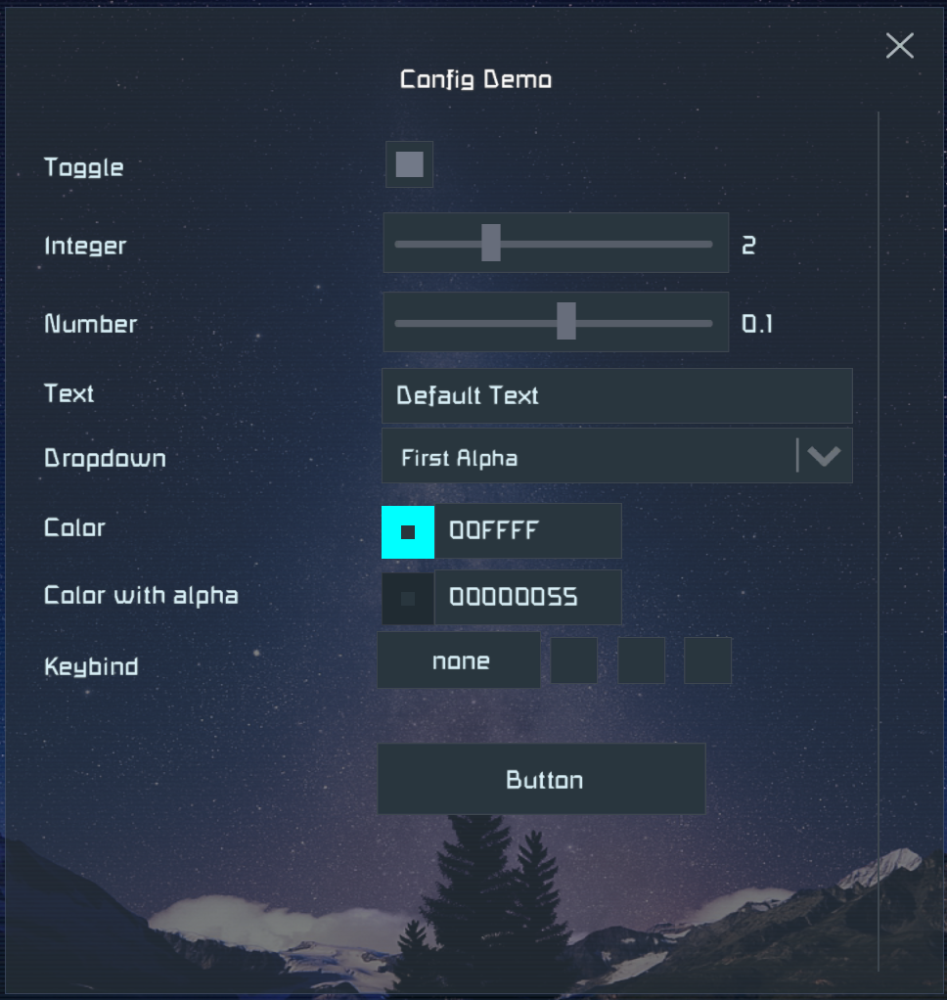

# Space Engineers Plugin Template

[Client only version of the template](https://github.com/sepluginloader/ClientPluginTemplate)

## Prerequisites

- [Space Engineers](https://store.steampowered.com/app/244850/Space_Engineers/)
- [Python 3.x](https://python.org) (tested with 3.9)
- [Plugin Loader](https://github.com/sepluginloader)
- [Torch Server](https://torchapi.com/) in `C:\Torch`, run `Torch.Server.exe` once to prepare
- [.NET Framework 4.8.1 Developer Pack](https://dotnet.microsoft.com/en-us/download/dotnet-framework/net481)

## Create your plugin project

1. Click on **Use this template** (top right corner on GitHub) and follow the wizard to create your repository
2. Clone your repository to have a local working copy
3. Run `setup.py`, enter the name of your plugin project in `CapitalizedWords` format
4. Let `setup.py` auto-detect your install locations or fill them in manually
5. Open the solution in Visual Studio or Rider
6. Make a test build, it should deploy the resulting files to their respective target folders (see them in the build log)
7. Test that the empty plugin can be enabled in Plugin Loader (client), Torch Server's UI and the Dedicated Server's UI
9. Replace the contents of this file with the description of your plugin
10. Follow the TODO comments in the source code
11. Look into the source code of other plugins for examples on how to patch the game

You may find the source code of these plugins inspirational:
- [Performance Improvements](https://github.com/viktor-ferenczi/performance-improvements)
- [Multigrid Projector](https://github.com/viktor-ferenczi/multigrid-projector)
- [Toolbar Manager](https://github.com/viktor-ferenczi/toolbar-manager)

In case of questions please feel free to ask the SE plugin developer community on the
[Plugin Loader](https://discord.gg/6ETGRU3CzR) or the [Torch](https://discord.gg/xNFpHM6V8Q)
Discord server in their relevant text channels. They also have dedicated channels for
plugin ideas, should you look for a new one.

_Good luck!_

## Remarks

### Plugin configuration

You can have a nice configuration dialog with little effort in the game client.
Customize the `Config` class in the `ClientPlugin` project, just follow the examples.
It supports many different data types, including key binding. Once you have more
options than can fit on the screen the dialog will have a vertical scrollbar.

The server plugin configuration works differently, please see the `Config` folder
of the `Shared` project for that. Torch plugins also have a XAML descriptor for
their configuration. The client side `Config` class is not integrated with the
server side configuration, currently.

### Conditional compilation

- DedicatedPlugin defines `DEDICATED`, TorchPlugin defines `TORCH`.
  You can use those names for conditional compilation by `#if` blocks in the Shared project.
  For example if you want your code to compile for client and dedicated server plugins, but
  not for the Torch plugin, then put it into a `#if !TORCH` ... `#endif` block.

### Shared project

- Put any code you can share between the plugin projects into the Shared project.
  Try to keep the redundancy at the minimum.

- The DLLs required by your Shared code need to be added as a dependency to all the projects,
  even if some of the code is not used by one of the projects.

- You can delete the projects you don't need. If you want only a single project,
  then move over what is in the Shared one, then you can delete Shared.

### Torch plugin

- For Torch plugins see also the official
  [Torch Plugin Template](https://torchapi.com/wiki/index.php/Torch_Plugin_Template),
  it has some additional information in its `README.txt` file.

- If you don't need the config UI in Torch for your plugin, then remove the IWpfPlugin
  from the Plugin class and the `xaml` and `xaml.cs` files. Also remove the now unused
  `GetControl` method.

- While you can use HarmonyLib for patching in Torch plugins, Torch has its own patching
  mechanism, which is more compatible with other plugins, but less convenient to use.
  If you want to remove Harmony from the Torch plugin, then search for USE_HARMONY in all
  files, which will show you where to make changes. Also remove Lib.Harmony from the
  TorchPlugin project's NuGet package dependencies. Please note then in this case you
  must also remove all uses of Harmony from your Torch plugin code.

### How to prevent the potential crash after game updates

Please use the `EnsureCode` attribute on patch methods to safely skip loading the plugin
with an error logged should the code in any of the methods patched would change as part of
a game update. It is a good way to prevent blaming crashes on your plugin after game updates,
so your plugin can remain safely enabled (but effectively disabled) until you have a chance
to release an update for compatibility with the new game version. Please see the examples in
the `Shared/Patches` folder on how to use this attribute.

The hexadecimal hash code is logged in case of a mismatch, so you can read them from the logs
for any new method you patch, just leave the string initially empty in the `EnsureCode`
attribute, then replace with the value from the error log line after you run your plugin
with the patch for the first time.

On Proton (Linux) this check tends to cause issues, therefore there is a configuration flag
to turn it OFF. Setting the `SE_PLUGIN_DISABLE_METHOD_VERIFICATION` environment variable to
any value on the player's host also disables game code verification.

### Debugging

- Always use a debug build if you want to set breakpoints and see variable values.
- A debug build defines `DEBUG`, so you can add conditional code in `#if DEBUG` blocks.
- While debugging a specific target unload the other two. It prevents the IDE to be confused.
- If breakpoints do not "stick" or do not work, then make sure that:
  - Other projects are unloaded, only the debugged one and Shared are loaded.
  - Debugger is attached to the running process.
  - You are debugging the code which is running (no code changes made since the build).
- Transpiler patches will write a `harmony.log.txt` file to your `Desktop` while running `Debug`
  builds. Never release a debug build to your users, because that would litter their desktop
  as well.
- To debug transpiler changes to the IL code it is most practical to generate the files
  of the method's IL code before and after the change made, so you can just diff them.
  Please see the transpiler example under the `Shared/Patches` folder for the details.

### Troubleshooting

- If the IDE looks confused, then restarting it and the debugged game usually works.
- If the restart did not work, then try to delete caches used by your IDE and restart.
- If your build cannot deploy (just runs in a loop), then something locks the DLL file.
- Look for running game processes (maybe stuck running in the background) and kill them.

### Release

- Always make your final release from a RELEASE build. (More optimized, removes debug code.)
- Always test your RELEASE build before publishing. Sometimes is behaves differently.
- In case of client plugins the Plugin Loader compiles your code, watch out for differences.

### Communication

- In your documentation always include how players or server admins should report bugs.
- Try to be reachable and respond on a timely manner over your communication channels.
- Be open for constructive critics.

### Abandoning your project

- Always consider finding a new maintainer, ask around at least once.
- If you ever abandon the project, then make it clear on its GitHub page.
- Abandoned projects should be made hidden on PluginHub and Torch's plugin list.
- Keep the code available on GitHub, so it can be forked and continued by others.
